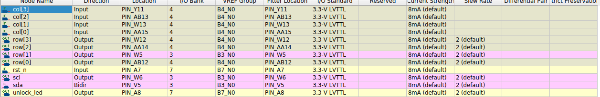

# Đặc Tả Kỹ Thuật Hệ Thống Khóa Mật Khẩu

**Phiên bản:** 1.0  
**Ngày phát hành:** 27/04/2026  
**Đối tượng:** DE10-Lite Kit (Intel MAX 10 – 10M50DAF484C7G)  
**Ngôn ngữ thiết kế:** System Verilog / Verilog  

---

## 1. Tổng Quan

Hệ thống khóa mật khẩu là một thiết kế nhúng trên FPGA, sử dụng bàn phím ma trận 4×4 làm thiết bị nhập và màn hình LCD I²C 16×2 làm giao diện hiển thị. Chức năng chính bao gồm: xác thực mật khẩu để mở khóa (Unlock), đổi mật khẩu (Change Password), và hủy thao tác (Cancel). Hệ thống được tối ưu cho kit DE10-Lite với cấu trúc máy trạng thái (FSM) tường minh, đảm bảo hoạt động ổn định, chống nhiễu hiển thị và dễ dàng mở rộng.

Mật khẩu mặc định (Default Password): **`1234`**.

---

## 2. Quy Ước Bàn Phím Ma Trận 4×4

Bàn phím ma trận 4×4 được ánh xạ chức năng như sau:

| Phím   | Chức năng                                              |
|--------|--------------------------------------------------------|
| `0`-`9`| Nhập ký tự số của mật khẩu                             |
| `A`    | Xác nhận (Enter / OK)                                  |
| `B`    | Kích hoạt chế độ Đổi mật khẩu (Change Password)        |
| `C`    | Hủy (Cancel) – xoá dữ liệu đang nhập, trở về màn hình chờ |
| `*`    | Dự phòng (không sử dụng, đảm bảo FSM an toàn)          |
| `#`    | Dự phòng (không sử dụng)                               |
| `D`    | Dự phòng (không sử dụng)                               |

**Ghi chú:** Hệ thống chỉ kích hoạt phản hồi khi có sự kiện nhấn phím (phát hiện cạnh xuống). Các phím dự phòng không làm thay đổi trạng thái.

---

## 3. Đặc Tả Các Cách Sử Dụng 

### 3.1 Mở Khóa Thành Công 

| #  | Hành động người dùng                          Cách  | Trạng thái hệ thống / Hiển thị LCD (Dòng 1 / Dòng 2) |
|----|------------------------------------------------|--------------------------------------------------------|
| 1  | Khởi tạo (hoặc sau Reset)                      | `"Enter Pass:     "` / `"                "`           |
| 2  | Nhấn lần lượt 4 phím số trùng với mật khẩu hiện tại (ví dụ: `1`, `2`, `3`, `4`) | Mỗi phím hiển thị một dấu `*` che giấu mật khẩu nhập vào. Sau 4 ký tự: `"****            "` |
| 3  | Nhấn phím `A` (Xác nhận)                       | `"Checking...     "` / `"                "`           |
| 4  | Hệ thống so khớp thành công                    | `"Unlock Success! "` / `"    Welcome     "`           |
|    |                                                | LED `unlock_led` được kéo lên mức cao.               |
| 5  | Tự động sau 1 giây                             | Quay về màn hình chờ: `"Enter Pass:     "` / `"                "`. LED tắt. |

### 3.2 Nhập Sai Mật Khẩu 

| #  | Hành động người dùng                            | Trạng thái hệ thống / Hiển thị LCD                       |
|----|------------------------------------------------|--------------------------------------------------------|
| 1  | Ở màn hình chờ, nhấn 4 phím số bất kỳ không khớp mật khẩu hiện tại (ví dụ: `5`, `5`, `6`, `6`) | Hiển thị `"****            "` trên dòng 1.           |
| 2  | Nhấn phím `A`                                  | `"Wrong Password! "` / `"  Please Wait   "`           |
| 3  | Hệ thống giữ trạng thái báo lỗi trong 1 giây   | Đèn LED `unlock_led` vẫn tắt.                         |
| 4  | Sau 1 giây                                     | Tự động quay về màn hình chờ `"Enter Pass:     "`.    |

### 3.3 Thay Đổi Mật Khẩu Mới

| #  | Hành động người dùng                              | Trạng thái hệ thống / Hiển thị LCD                       |
|----|--------------------------------------------------|--------------------------------------------------------|
| 1  | Từ màn hình chờ, nhấn phím `B`                   | `"Enter Old Pass: "` / `"                "`            |
| 2  | Nhập đúng 4 số của mật khẩu HIỆN TẠI               | Hiển thị dấu `*` che mỗi ký tự nhập.                  |
| 3  | Nhấn phím `A` để xác nhận mật khẩu cũ            | - Nếu khớp: chuyển sang bước 4.                       |
|    |                                                  | - Nếu sai: hiển thị `"Wrong Password! "` / `"  Please Wait   "` trong 1 giây, sau đó quay về màn hình chờ. |
| 4  | Nhập mật khẩu cũ thành công                     | `"Enter New Pass: "` / `"                "`            |
| 5  | Nhập 4 số của mật khẩu MỚI (ví dụ: `9`, `8`, `7`, `6`) | Hiển thị dấu `*` che giấu từng ký tự.                 |
| 6  | Nhấn phím `A` để lưu mật khẩu mới               | `"Pass Changed!   "` / `"  Successfully  "`            |
|    |                                                  | LED `unlock_led` giữ nguyên trạng thái tắt.           |
| 7  | Kết thúc                                         | Hệ thống tự động quay về màn hình chờ với mật khẩu mới đã có hiệu lực. |

### 3.4 Hủy Thao Tác 

| #  | Hành động người dùng                              | Trạng thái hệ thống / Hiển thị LCD                       |
|----|--------------------------------------------------|--------------------------------------------------------|
| 1  | Đang trong quá trình nhập ký tự (mở khóa hoặc đổi mật khẩu) | Nhấn phím `C` bất kỳ lúc nào.                          |
| 2  |                                                  | Hệ thống xóa toàn bộ dữ liệu đã nhập và ngay lập tức quay về màn hình chờ: `"Enter Pass:     "` / `"                "`. |

---

## 4. Yêu Cầu và Thiết Lập Phần Cứng

- **Kit mục tiêu:** Terasic DE10-Lite, FPGA Intel MAX 10 `10M50DAF484C7G`.
- **Clock:** Cấp xung nhịp 50 MHz vào chân `clk` (thông qua bộ dao động thạch anh trên kit).
- **Reset (rst_n):**  
  - Tín hiệu Reset là **Active-Low**.  
  - Kết nối `rst_n` tới một nút nhấn (Push Button) trên kit, ví dụ `KEY0`.  
  - Khi nút nhấn được nhấn (mức LOW), hệ thống bị reset. Khi nhả ra (mức HIGH), hệ thống hoạt động.  
- **GPIO – I²C (LCD 16×2):**  
  - Hai chân `SDA` và `SCL` của module LCD I²C phải được nối tới các chân GPIO của FPGA thông qua điện trở kéo lên (Pull-up Resistor) phù hợp với mức điện áp 3.3V.  
  - Đảm bảo địa chỉ I²C của LCD (thường là `0x27` hoặc `0x3F`) khai báo đúng trong module `lcd_display.v`.  
- **LED chỉ thị:**  
  - `unlock_led`: mức HIGH khi mở khóa thành công. Có thể gán tới một LED trên kit (ví dụ `LEDR0`).  
- **Chống nhiễu hiển thị:** Khối FSM điều khiển các sự kiện thay đổi nội dung hiển thị được tách biệt hoàn toàn khỏi máy trạng thái truyền dữ liệu I²C, đảm bảo không xảy ra hiện tượng nhấp nháy (flickering) hay bóng mờ ký tự.

---

## 5. Kết nối phần cứng

## 6. Ghi Chú Triển Khai

- Trong toàn bộ quá trình nhập mật khẩu, mỗi ký tự số hợp lệ ngay lập tức được hiển thị thành dấu `*` để bảo mật.  
- Các chuỗi hiển thị cố định phải đảm bảo đúng độ dài 16 ký tự (padding bằng dấu cách nếu cần).  
- Bộ định thời (Timer) 1 giây dùng để hiển thị kết quả (thành công/thất bại) cần được đồng bộ với xung clock 50 MHz.  
- Mọi thay đổi trạng thái trong FSM đều được kích hoạt bởi sự kiện nhấn phím (cạnh xuống), ngoại trừ thời điểm time‑out tự động quay về màn hình chờ.  
- Đối với các phím dự phòng (`*`, `#`, `D`), hệ thống không phát sinh phản ứng và vẫn giữ trạng thái hiện tại an toàn.  

---

*--- Hết tài liệu ---*